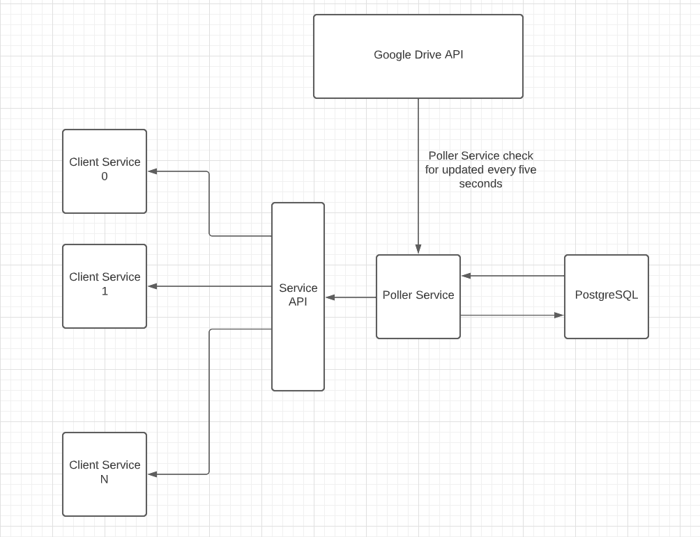

# Googlesheets excel tracker

This service polls Google Drive API and detects any change in Excel file.
Once change detected, service stores an updated version in PostgreSQL RDBMS.
Thus any client service can demand the latest data from this service.

# Schematic illustration

# Deployment
Assuming that service is deployed on Ubuntu server:

1. PostgreSQL installation:
Install PostgreSQL server and chech if it is up\
`sudo apt install postgresql`\
`sudo systemctl start postgresql`\
`sudo systemctl status postgresql`\

Connect to PostgreSQL as postgres user:\
`sudo su postgres`
`psql`

In psql console:
Create new user and new database:\
`create user <username>;`\
`create database <database_name>;`\
`grant all privileges on database <database_name> to <username>;`\

In case of connectivity problems to PostgreSQL server:\
`sudo su postgres`\
`psql`\
`show hba_file;`\
`sudo nano <path_to_hba_file>`\
Hba file contains PostgreSQL connection and authorization settings.
Furter information about hba files you can find in PostgreSQL 
[documentation](https://www.postgresql.org/docs/current/auth-pg-hba-conf.html)

### Configuring .env file
Enter PostgreSQL credentials:\
POSTGRESQL_HOST\
POSTGRESQL_PORT\
POSTGRESQL_USER\
POSTGRESQL_DB\
POSTGRESQL_PASSWORD\
Enter generated Django token:\
TOKEN\

Django token can be generated by following command:\
`python -c 'from django.core.management.utils import get_random_secret_key; print(get_random_secret_key())'`\

### Getting Google Drive credentials

Also, for proper service work you have to generate credentials.json from
Google Drive API. Further information about getting credentials can be found 
[here](https://developers.google.com/workspace/guides/create-credentials).

### Install dependencies
`source venv/bin/activate`\
`python -m pip install -r requirements.txt`

### Run migrations

`python manage.py migrate`\
Migration will populate DB with data from current Google Drive document

### Run project
Install Docker\
`sudo apt install docker docker-compose`

Run service:\
`docker-compose up --build`\
Attention - PostgreSQL must be deployed as a separate service on host. It is
not included in docker-compose.yml because PostgreSQL is a critical service
any accidental data loss can be irreversable. Putting PostgreSQL in a 
Docker container can be dangerous for DB data.

### Run project without Docker (Optional)

Install Redis and run\
`sudo apt install redis`\
`sudo systemctl start redis`\
Check Redis is up\
`sudo systemctl status redis`

Run project itself:\
`gunicorn canalservice.wsgi:application -b :8000`

Run Celery:\
`celery -A canalservice worker -n log@%h --loglevel=INFO -B`

### Project formatting 

`make format_project`
